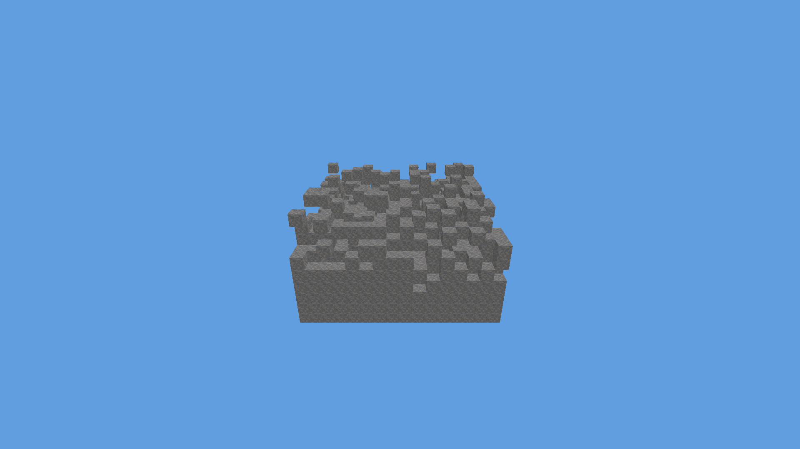
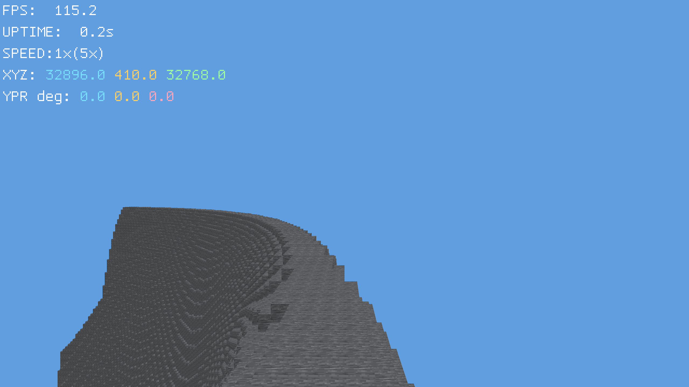
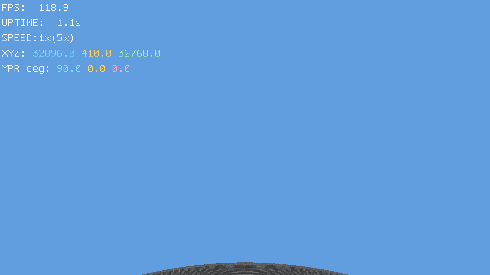
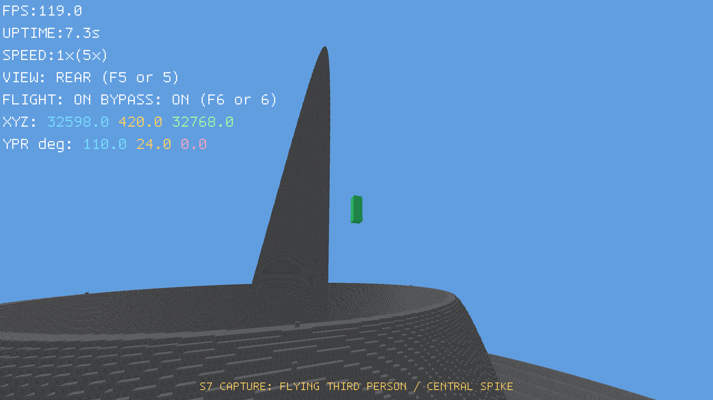
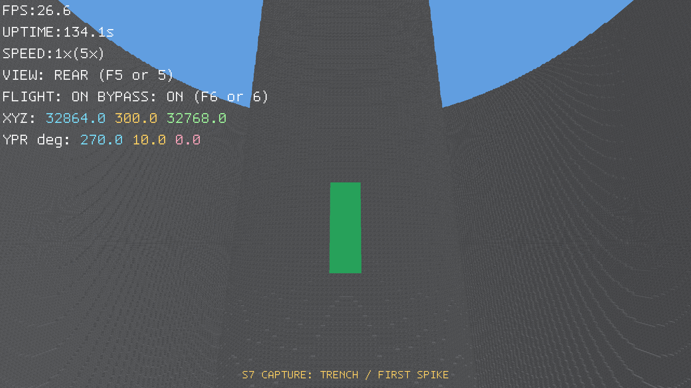
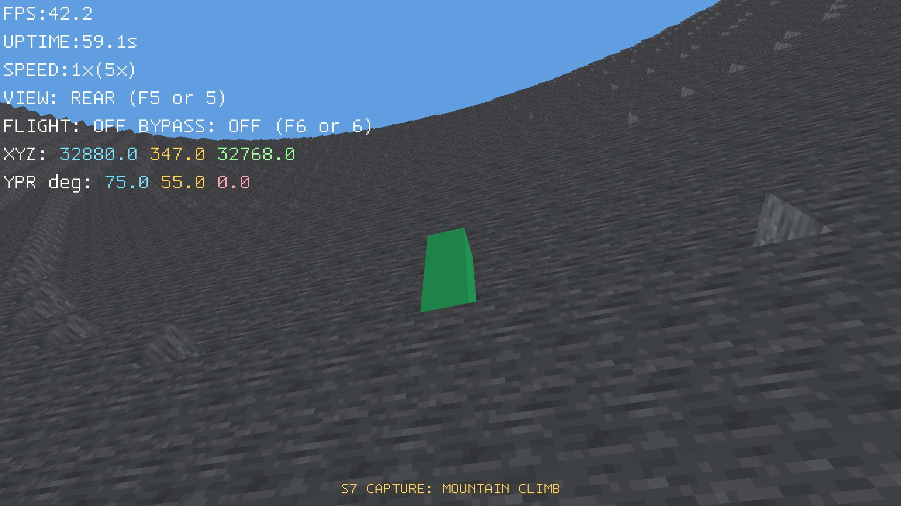
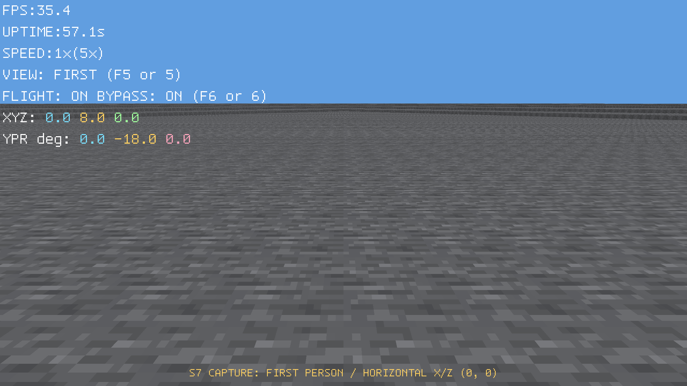

# Overview

This is the initiation version where the project structure is outlined and the modules are implemented in a simple way.

## Release status

Dated entries record snapshot version metadata and contents. For the AI line, the heading date is bound to the finalized source commit's timestamp interpreted in `Europe/Belgrade` and stays fixed through promotion. The tag date is derived from the promotion commit, while the aggregate task ledger records the actual publication date separately under [the version convention](../../VERSION_CONVENTION.md). These dates do not by themselves establish runtime acceptance.

# Snapshots

## EarlyDev 0.1.0:1(26.05.20)

First runnable application. There is no actual server/client yet, no rendering, no world.
Additions:
1. High-level project structure (main folders, MD files, conventions).
2. Proper building with CMake and dependency management with vcpkg.
3. Logging with `spdlog` and `fmt`.
4. Some helper files in `core/` (different macros, assertions, crash handling, etc).

## EarlyDev 0.1.0:2(26.05.25)

Basic network logic and client/server separation.
Additions:
1. Basic network API.
2. Simple 2D console game where real players and bots can roam around a 32x32 world.

## EarlyDev 0.1.0:3(26.09.10)

Basic rendering.
Additions:
1. Vulkan rendering of the existing flat world and players in a GLFW window.
2. Deterministic server and two-client scenarios with renderer smoke, capture, and benchmark evidence.
3. Relocatable macOS and Windows packages plus an arm64-v8a Android Vulkan application.
4. Exact-source snapshot promotion, cross-platform CI, checksums, provenance, and release-asset verification.

## EarlyDev 0.1.0:4(26.09.13)

Controllable 3D presentation of the authoritative flat multiplayer world.

These historical screenshots are actual 640x480 GLFW gameplay captures from the MC-AI-0118 visual-acceptance pass. They show the Snapshot 4 presentation; exact final-source package and runtime identity is recorded separately in the release evidence.

Additions:
1. Deterministic close third-person camera, camera-relative desktop and Android controls, and fixed-step render scheduling.
2. Depth-tested floating platform, grid, and player boxes with a reusable Runtime graphics/kernel path and fixed-size true-offscreen golden coverage.
3. Default-on texture-free shader bitmap debug HUD with windowed FPS, monotonic uptime, player position, and camera angles.
4. CoreLang 0.0.1 scripts, exact reusable CoreCpp/CoreProject2026 packages, and separated Runtime transport/game protocol boundaries.

## EarlyDev 0.1.0:5(26.09.13)

S5 adds the first textured voxel-world gameplay slice to the S4 foundation.

The visible runtime overview is shown above:
a seed-42 air-and-stone flight scene rendered with the original mottled
16-pixel stone texture. Actual GPU-rendered gameplay scene captured with the
fixed acceptance camera.

## EarlyDev 0.1.0:6(26.09.20)

S6 replaces the fixed preview with the mature sparse-world generation, streaming, and rendering foundation.

These are actual 2560x1440 macOS gameplay captures from the owner-accepted release candidate. The first shows detailed textured blocks and the semantic HUD near a wave ridge. The second shows camera-independent terrain residency after rotation toward the distant generated horizon.

Additions:
1. A sparse 65,536 by 65,536 by 1,024 air-and-stone world with horizontal wrapping, bounded resident state, and explicit vertical boundaries.
2. CoreLang 0.1.2 height-map configuration for a six-block base and fading concentric waves, with native block materialization and a central peak reaching 806 blocks.
3. Server-authoritative asynchronous terrain streaming with fixed near priority bands, a movement/view-oriented generation ellipse, rate-limited background fill, and a camera-independent 45-chunk residency circle.
4. Neighbor-aware detailed chunk meshes, incremental Vulkan uploads and frustum culling, textured stone, distance fog, and a gradient sky.
5. Continuous flight with toggle acceleration and 2x, 3x, 5x, 8x, 15x, 30x, 80x, 200x, and 500x profiles.
6. A reusable colored text renderer with separate GUI and world-text stages; the HUD reports readable coordinates, rotation, frame timing, uptime, and acceleration state.
7. Automated boundary, seam, scheduling, transport, sustained-flight, GPU capture, and 120 Hz renderer benchmark coverage.

## EarlyDev 0.1.0:7(26.10.08)

S7 adds server-authoritative permissions, movement, player presentation, and long-distance terrain rendering to the S6 world foundation.

These distinct 2560×1440 macOS captures were produced by Release binary SHA-256 `e34ae3bde2b7c950ec3fd50cb1eef79677eabad5007964409e4f481f962d9741`, built from product source commit `4a56ef5c1edf32aa4c4301ea1fc055b63b0ee64c` with locked CoreCpp `d5759fa48b7073787434121624b5f5f93cf3fa2c` and CoreProject2026 `a4d3fa8a7b81407d0f6bae3ef10d2632d7b74fb9`. The UDP-aware capture-test diff SHA-256 is `e1f90939a01114acc44b17f54b33bb0464c96210f9a814650340995e25852c83`.

The opt-in macOS Release `PlayerPlaytestCaptureTest` passed all four scenes in 265.31 seconds. Its [raw CTest log](../../ai/evidence/MC-AI-0390-capture-2026-10-09.raw.log) has SHA-256 `1e2f281a64f8d413124c1fe9c77f625bcef4df663db1b390ae9d8fc5d95b5ce5`. The central-spike view uses horizontal X/Z `(32598, 32768)`, height 420, yaw 110 degrees, pitch 24 degrees, and 100-degree vertical FOV: 170 blocks from the center, 30% closer and 20 blocks lower than the prior framing. It uses a 72-chunk server radius; the other three use the default 256-chunk terrain radius. The harness waits for full tile/mesh coverage, then sweeps all 16 camera headings before capture. Every image has an in-frame label centered below the HUD.

| Scene | Image | Dimensions | SHA-256 |
|---|---|---:|---|
| Central spike, third-person | `earlydev-0.1.0-7-central-spike.png` | 2560×1440 | `3b1e713bc7acac5e30d37ad2064cfa0d42891342fdacaa67bfafc2703235cea0` |
| Trench by first spike | `earlydev-0.1.0-7-trench-first-spike.png` | 2560×1440 | `8bd0e4a5285fa1fd9d915d3407434cb802b02b3e6b7f8bd914836e021c1828d6` |
| Mountain climb | `earlydev-0.1.0-7-mountain-climb.png` | 2560×1440 | `66d60361787962794c0d35a6d21cb808b92ed465748d635d5625f440b996f966` |
| Origin, first-person | `earlydev-0.1.0-7-first-person-origin.png` | 2560×1440 | `967fdd25d2f4a394d7ec1e1a29fe4f80eff8c5aa9291dd5e5b80f300e0204182` |

Additions:
1. General entity permissions with hard restrictions, overridable soft defaults, group resolution, and player mode presets.
2. Authoritative movement, collision and flight permissions, a correctly proportioned 16-color player body, and first-, rear-third-, and front-third-person views.
3. Client/server connection resilience and deterministic acceptance for latency, loss, jitter, freezes, reordering, and duplication.
4. Camera-independent, position-driven terrain residency with projection-derived mesh detail and validated render distance up to 256 chunks.
5. CoreLang 0.1.3.1-compatible integration with the permitted 0.1.3.3 maintenance package, reusable Runtime execution/audio foundations, and presentation diagnostics.
6. Full-game performance and capture harnesses plus required automated sanitizer and static-analysis release checks.
